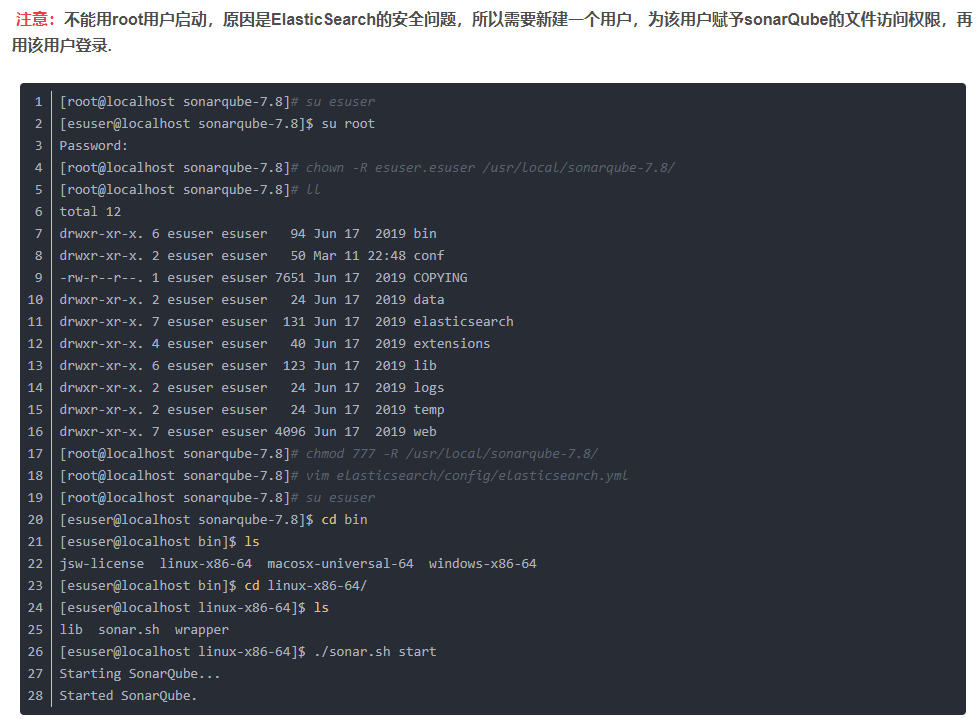
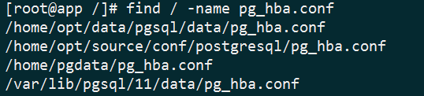
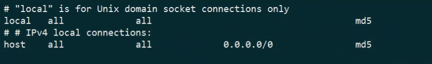
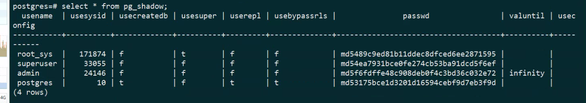

连接数据库密码认证错误, 修改密码，superuser问题
-------------
生产环境数据库突发事故。程序以及navicat突然无法连接数据库，报密码不对

- 检查数据库运行状态，检查数据库是否正常运行，正常运行状态，但是连接不上
~~~
systemctl statuc postgresql-11
~~~

- 检查数据库密码是否正确，问了几个同事之后发现，密码是错误，需要更改密码
- 查找postgress跳过密码认证，修改配置文件的认证方式
~~~
 find / -name pg_hba.conf
~~~
- 找到对应目录之后，进行修改，有时可能存在多个，挨个修改重启数据库

~~~
vi /var/lib/pgsql/11/data/pg_hba.conf
~~~

- 将里面的md5改成trust，然后重启数据库

~~~
systemctl restart postgresql-11
~~~
- 重启完成后，进入数据库
~~~
psql -U postgres  
~~~
- 根据下面的命令直接修改密码，如果成功之后，再把刚才的pg_hba.conf改md5，重启下就可以了
~~~
alter user postgres with password '123456';
~~~

- 不行的往下看

- 执行下面的sql，要在保持无密码的情况下执行。可以看到他有一列是usersuper，发现root_sys是有的
~~~
 select * from pg_shadow;
~~~

- 使用另一个命令，切换到这个用户，然后修改密码，就可以了，记得打开日志，留一个操作说明
~~~
\c postgres //切换数据库
\c - root_sys //切换到superuser用户
~~~
- 执行上面的修改密码命令，成功，就可以了，记得把conf配置文件修改回去

Why this repo
-------------
- 问题1

